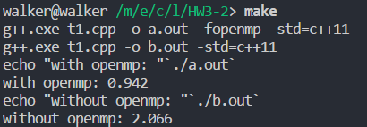

# 作业三

## 第一题

### 题目

Consider a simple loop that calls a function dummy containing a programmable delay.All invocations of the function are independent of the others. Partition this loop across four threads using static, dynamic, and guided scheduling. Document the result of this experiment as the delay within the dummy function becomes large.

### 题目分析

考虑一个简单的循环，循环内部调用一个包含有一个可编程的延迟。

对这个函数的每一次调用与其他的调用都是相互独立，互不影响的。

将这个循环使用几种不同的调度方法分配给四个线程（可使用static，dynamic，等调度方法）

当函数内的延迟渐渐变大时，将这个实验的结果写出来。

### 参考答案

When the function becomes computationally expensive, all of the formulations can be expected to perform
similarly.

## 第二题

### 题目

Implement and test the OpenMP program for computing a matrix-matrix (50 * 50) product. Use the OMP_NUM_THREADS environment veriable to control the number of threads and plot the performance with varying numbers of threads. Consider three cases in which 
(i)only the outermost loop is parallelized.
(ii)the outer two loops are parallelized. 
(iii) all three loops are parallelized. 

What is the observed result from these three cases?

### 实验前提

#### 矩阵规模

在测试过程中发现，50*50的矩阵乘法规模太小，导致在输出时间的时候在大多数情况下只会输出0。出于便于研究，易于对比数据的目的，此后研究的矩阵乘法均是TODO:矩阵规模。

#### 运行性能的评价

本次实验在评价矩阵乘法的性能时，主要以两个维度来进行评价。

1. $T_{ave}$矩阵乘法运行的平均时间（运行三次取平均值），单位为秒。
1. $S_p = \frac{T_1}{T_p}$加速比：串行运行的时间除以并行运行的时间。
    1. ${\displaystyle T_{1}}$指顺序执行算法的执行时间
    1. ${\displaystyle T_{p}}$指当有p个线程时，并行算法的执行时间
1. $E_p = \frac{S_p}{p}$效率
    1. $p$是指线程数量。

https://zh.wikipedia.org/wiki/%E5%8A%A0%E9%80%9F%E6%AF%94

### 矩阵乘法的实现

可见代码文件中的`t1.cpp`。除去其他的辅助函数，矩阵乘法的核心部分如此实现。

```cpp
void product(){
    # pragma omp parallel for collapse(3)
    // 该参数用于设置并行到哪一个级别的循环
    for (int i = 0; i < MATRIX_SIZE; i++){
        for (int j = 0; j < MATRIX_SIZE; j++){
            for (int k = 0; k < MATRIX_SIZE; k++){
                ans[i][j] += lhs[i][k]*rhs[k][j];
            }
        }
    }
}
```

从注释中，可以看到代码块中的三个循环外都具有一个用于OpenMP的并行化宏指令。下面的三个部分，研究了这些宏指令的三种情况，分别对应本题的三个小问。

1. 情况一：只有最外层有宏指令
1. 情况二：最外层和中间层都有宏指令
1. 情况三：最外层，中间层，嘴里层都有宏指令

> 注意，这里并未考虑为cache读写优化的矩阵乘法

### 情况一

当只有最外层有宏指令的时候，

在只有一层循环并行化的情况下，设置环境变量`OMP_NUM_THREADS`为20，计算700阶的矩阵乘法，得到下面的结果。



|测试类型|运行时间|
|-|-|
|具有多线程优化 | 0.948s|
|没有多线程优化 | 2.349s|

很明显，在具有多线程优化的情况下，该矩阵乘法运行得更快。

csv:
线程数量,并行循环层数,矩阵维度,CPU时间,Wall时间

#### 两层循环并行化

慢了

#### 三层循环并行化

更慢

### 实验结果及分析

1. 横向的比较中，对嵌套循环并行度的设置不同，运行的时间也略有差异
1. 在纵向的比较中，线程数越多，矩阵运算的时间越短？？