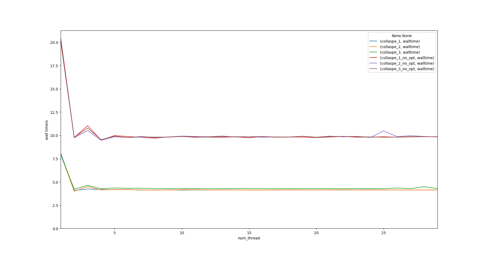
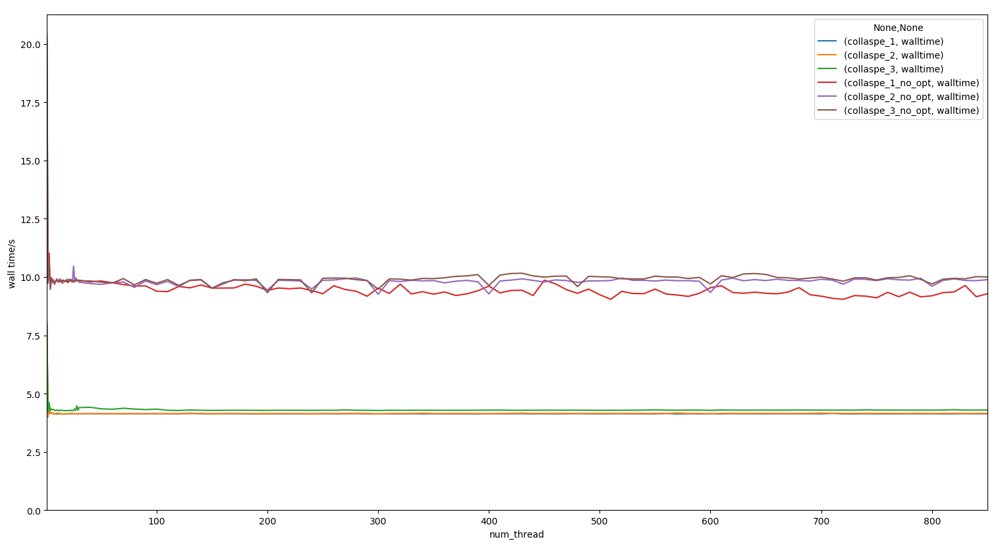

# 作业三

## 第一题

### 题目

Consider a simple loop that calls a function dummy containing a programmable delay.All invocations of the function are independent of the others. Partition this loop across four threads using static, dynamic, and guided scheduling. scheduling. Use different parameters for static and guided scheduling.Document the result of this experiment as the delay within the dummy function becomes large.

### 题目分析

考虑一个简单的循环，循环内部调用一个包含有一个可编程的延迟。

对这个函数的每一次调用与其他的调用都是相互独立，互不影响的。

将这个循环使用几种不同的调度方法分配给四个线程（可使用static，dynamic，guided等调度方法）

对这些调度方法使用不同的参数。

当函数内的延迟渐渐变大时，将这个实验的结果写出来。

### 评价指标

1. 加速比

### 分析方法

1. 人为选择一个比较合适的参数，然后跑出对应的运行时间。
    1. 对不同的延迟，适当选择不同的参数。
    1. 延迟渐渐增大，
1. 画一个图


## 第二题

### 题目

Implement and test the OpenMP program for computing a matrix-matrix (50 * 50) product. Use the OMP_NUM_THREADS environment veriable to control the number of threads and plot the performance with varying numbers of threads. Consider three cases in which 
(i)only the outermost loop is parallelized.
(ii)the outer two loops are parallelized. 
(iii) all three loops are parallelized. 

What is the observed result from these three cases?

### 实验前提

#### 矩阵规模

在测试过程中发现，50*50的矩阵乘法规模太小，导致在输出时间的时候在大多数情况下只会输出0。出于便于研究，易于对比数据的目的，此后研究的矩阵乘法均是1200维下的矩阵乘法。

#### 测试环境

在我自己电脑进行测试的时候，由于我一边用我自己的电脑完成作业，一边跑程序，跑出来的时间波动过大，看不出规律，因此，对于测试环境，要求要尽可能少的活动进程，本次作业的数据，我是在宿舍的一台没有人用的电脑跑的，保证了运行环境没有过多的其他进程的干扰。

#### 运行性能的评价

本次实验在评价矩阵乘法的性能时，主要以运行时间来进行评价。

1. $T_{ave}$矩阵乘法运行的平均时间（运行三次取平均值），单位为秒。
1. $S_p = \frac{T_1}{T_p}$加速比：串行运行的时间除以并行运行的时间。
    1. ${\displaystyle T_{1}}$指顺序执行算法的执行时间
    1. ${\displaystyle T_{p}}$指当有p个线程时，并行算法的执行时间
1. $E_p = \frac{S_p}{p}$效率
    1. $p$是指线程数量。

https://zh.wikipedia.org/wiki/%E5%8A%A0%E9%80%9F%E6%AF%94

### 矩阵乘法的实现

可见代码文件中的`t1.cpp`。除去其他的辅助函数，矩阵乘法的核心部分如此实现。

```cpp
void product(){
    # pragma omp parallel for collapse(3)
    // 该参数用于设置并行到哪一个级别的循环
    for (int i = 0; i < MATRIX_SIZE; i++){
        for (int j = 0; j < MATRIX_SIZE; j++){
            for (int k = 0; k < MATRIX_SIZE; k++){
                ans[i][j] += lhs[i][k]*rhs[k][j];
            }
        }
    }
}
```

在OpenMP编译指令中，可以见到`collapse`，其后的数字表明并行化的循环层数，根据这个层数，我分为三种情况来研究，这三种情况分别对应题目的三小问。

1. 情况一：最外层循环并行化
1. 情况二：两层循环并行化
1. 情况三：三层循环并行化

#### 对cache优化的简单矩阵乘法

考虑到计时不准的缘故，尽量的减少I/O时间能够提高实验结果的准确度。因此我对该矩阵乘法做了一些不影响并行度的对`cache`友好的优化，再重复进行了一次实验。

优化后的代码如此实现,通过将第二层循环和第三层循环交换位置，提高该矩阵乘法的空间局部性，从而减少程序cache不命中的情况。

```cpp
void product(){
    # pragma omp parallel for collapse(3)
    // 该参数用于设置并行到哪一个级别的循环
    for (int i = 0; i < MATRIX_SIZE; i++){
        for (int k = 0; k < MATRIX_SIZE; k++){
            for (int j = 0; j < MATRIX_SIZE; j++){
                ans[i][j] += lhs[i][k]*rhs[k][j];
            }
        }
    }
}
```

### 未优化情况下，三种情况的对比。

本程序在物理双核，逻辑四核的笔记本上运行，并记录运行时间。
当运行线程数控制在1-30范围中时，下图为运行时间随线程数量变化的图。


当运行线程数控制在1-850范围中时，下图为运行时间随线程熟练变化的图。


运行时间数据详见[all_time.csv](./HW3-2/all_time.csv)。


### 实验结果

1. 在对cache没有优化的矩阵乘法中，运行时间波动大，从中反映的运行时间规律不明确。相对而言，对cache优化后的矩阵乘法总体运行时间波动较小，反映的规律较为可信。
1. 从对cache优化过的矩阵乘法得出的结果可知，三层循环都并行化时，运行时间总是会比其他两种情况长约3.5%。


